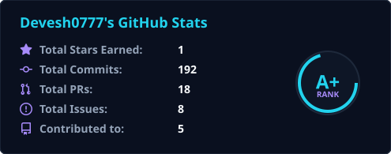
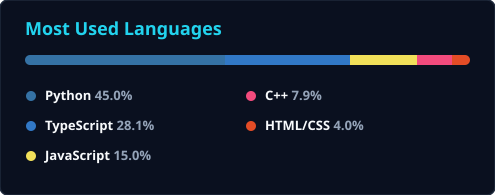
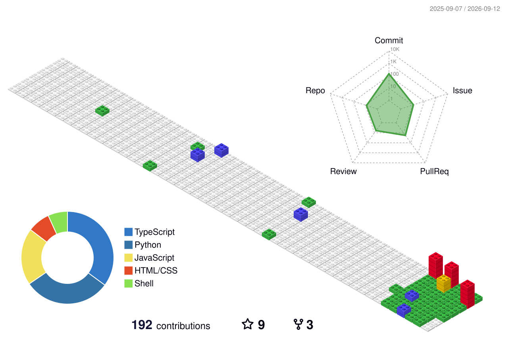

 

<!-- Social Badges -->
&nbsp;

  

<!-- Stats Row -->

  

<!-- Streak -->

  

<!-- Full-Width Contribution Heatmap with Snake -->

  

<!-- PCB Card full width-ish -->

  

<!-- 3D Block Contribution Graph (GitBlock) -->

